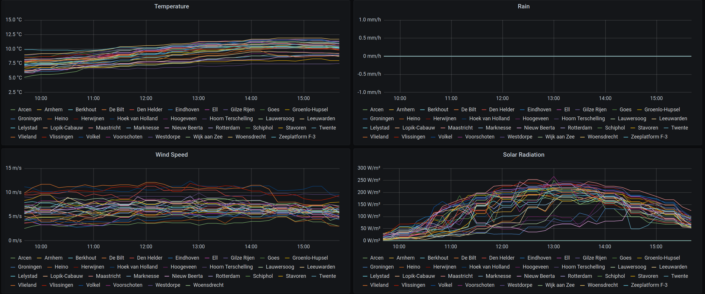

Buienradar Prometheus Exporter
==============================

A Simple Python program that exports data from the
[Buienradar API](https://data.buienradar.nl/1.0/feed/xml) to Prometheus.

Not affiliated with https://buienradar.nl/

## Dashboard

You can find a preconfigured Grafana Dashboard [here](grafana-dashboard.json).

Since the data the KNMI, that Buienradar queries, gathers data in intervals of
10 minutes, the graphs display the average values over a moving window.
